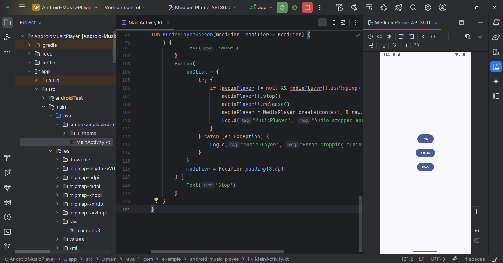

# Android Music Player

A simple Android music player built with Jetpack Compose. Plays `piano.mp3` from `res/raw/` with Play, Pause, and Stop controls.

## Features
- Jetpack Compose UI with Play, Pause, and Stop buttons.
- Plays `piano.mp3` using `MediaPlayer`.
- Basic media playback controls.

## Screenshot

## Setup
1. Clone the repository: `git clone https://github.com/johnkoshy/Android-Music-Player.git`
2. Open in Android Studio (Meerkat Feature Drop | 2024.3.2 or later).
3. Run on an emulator or device (API 25+).

## License
MIT License 
